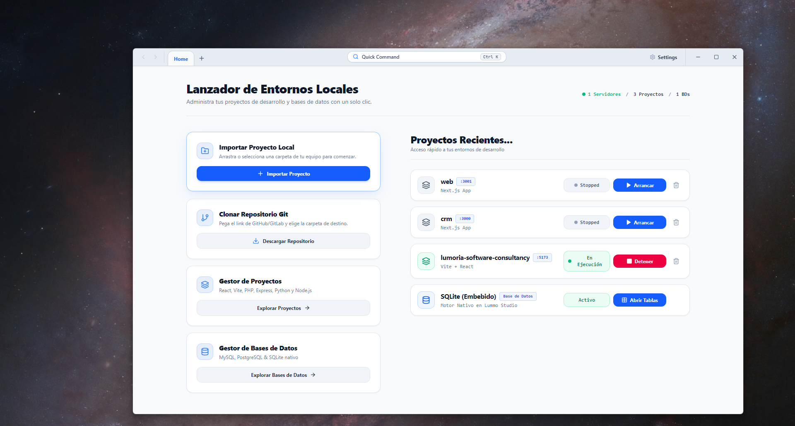
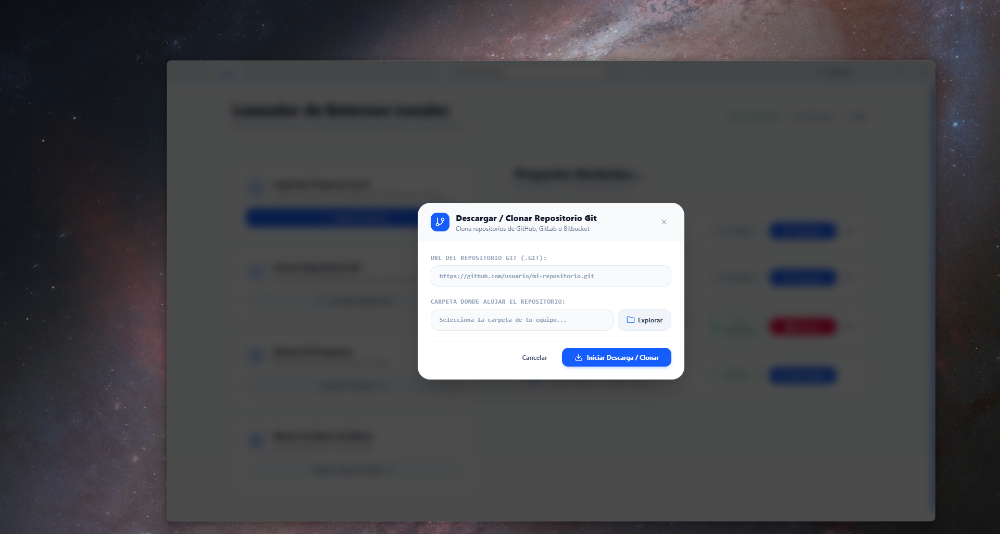
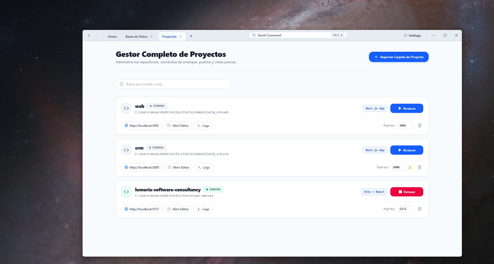
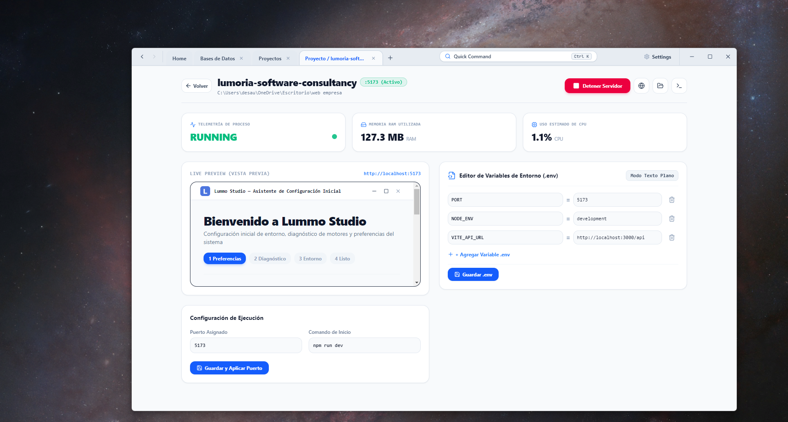

<p align="center">
  
</p>

<h1 align="center">Lummo Studio</h1>

<p align="center">
  <strong>Panel de Control Moderno de Entornos de Desarrollo Locales & Gestor de Bases de Datos</strong>
</p>

<p align="center">
  
  
  
  
  
</p>

---

## 🖼️ Vista Previa & Capturas de Pantalla

<p align="center">
  
</p>

<h3 align="center">Dashboard Principal</h3>
<p align="center">
  
</p>

<h3 align="center">Detalle de Proyecto, Telemetría & Live Preview</h3>
<p align="center">
  
</p>

<h3 align="center">Panel de Bases de Datos & Workbench SQL</h3>
<p align="center">
  
</p>

<h3 align="center">Buscador Omnibox (`Ctrl + K`) & Atajos Rápido</h3>
<p align="center">
  
</p>

---

## 📖 Descripción General

**Lummo Studio** es una alternativa moderna, rápida e intuitiva a paneles tradicionales de servidores locales (como XAMPP, WampServer o MAMP). Diseñado específicamente para desarrolladores web contemporáneos, combina la administración de servidores web de múltiples stacks (React, Vite, Next.js, Node.js, Express, PHP/Laravel, Python) con un explorador relacional de bases de datos embebido y herramientas integradas de productividad.

---

## ✨ Características Principales

### 🚀 1. Gestión Inteligente de Proyectos Multi-Stack
- **Detección Automática**: Reconoce automáticamente el stack tecnológico del proyecto (`Vite + React`, `Next.js`, `Express`, `PHP / Laravel`, `Python`) al seleccionar una carpeta.
- **Asignación Dinámica de Puertos**: Busca y asigna puertos libres en el sistema de manera automática.
- **Control de Estado en Vivo**: Arranca y detiene servidores con un solo clic.
- **Forzado Limpio de CLI**: Inyecta banderas CLI (`--port <puerto>`) para garantizar que herramientas como Vite o Next.js escuchen estrictamente en el puerto asignado.

### 📥 2. Clonación Directa de Repositorios Git
- **Modal Integrado**: Pega el enlace de cualquier repositorio público de Git (`https://github.com/usuario/repo.git`) y selecciona la carpeta de destino.
- **Progreso en Tiempo Real**: Barra de progreso animada del 0 al 100% que analiza y transmite el estado de descarga de objetos de Git.
- **Cancelación Activa & Manejo de Errores**: Cancela descargas en progreso mediante `taskkill` con banners informativos para repositorios privados o rutas duplicadas.
- **Importación Automática**: Al finalizar la clonación, el proyecto se registra e importa directamente a Lummo Studio.

### 🟢 3. Integración con la Bandeja del Sistema (System Tray)
- **Segundo Plano Continuo**: Al cerrar la ventana principal (`✕`), Lummo Studio se minimiza a la bandeja de notificación de Windows sin interrumpir tus servidores en ejecución.
- **Menú Contextual Nativo**: Haz clic derecho sobre el icono en la bandeja para ver cuántos servidores están activos, abrir la ventana o cerrar todos los procesos de forma limpia.

### 📝 4. Editor de Variables de Entorno (`.env`) & Sincronización Automática
- **Modo Formulario Clave-Valor & Texto Plano**: Edita variables de entorno fácilmente.
- **Auto-Reinicie en Cambio de Puerto**: Al modificar el puerto asignado y pulsar *Guardar y Aplicar Puerto*, Lummo Studio actualiza el archivo `.env` y reinicia el servidor automáticamente en el nuevo puerto.

### 🗄️ 5. Workbench SQL Embebido
- **Soporte Multi-Motor**: Administra motores **SQLite** (embebido nativo en Lummo), **MySQL / MariaDB** y **PostgreSQL**.
- **Explorador Tabular de Datos**: Consulta tablas, ejecuta queries y visualiza registros en una interfaz fluida.

### ⚡ 6. Buscador Omnibox (Buscador Rápido `Ctrl + K`)
- **Atajos Teclado Universales**: Presiona `Ctrl + K` desde cualquier pantalla para desplegar la paleta de comandos.
- Presiona **`N`** (Nuevo Proyecto), **`P`** (Proyectos), **`D`** (Bases de Datos) o **`S`** (Ajustes) para navegar instantáneamente.

### 🌐 7. Motor Multilingüe y Apariencia Visual
- **Sistemas de Idioma JSON**: Cambia en tiempo real entre Español e Inglés.
- **Modo Claro & Modo Oscuro (Antigravity Matte Charcoal)**: Interfaz responsiva con componentes minimalistas y sin barras de desplazamiento externas.

---

## 🛠️ Requisitos del Sistema

- **Sistema Operativo**: Windows 10 / 11 (64-bit)
- **Node.js**: v18.0.0 o superior
- **Git**: Instalado y disponible en el `PATH` del sistema (para la función de clonación de repositorios)

---

## ⚙️ Instalación y Configuración para Desarrollo

1. **Clonar el Repositorio**:
   ```bash
   git clone https://github.com/tu-usuario/lummo-studio.git
   cd lummo-studio
   ```

2. **Instalar Dependencias**:
   ```bash
   npm install
   ```

3. **Ejecutar en Modo Desarrollo (Vite + Electron)**:
   ```bash
   npm run electron:dev
   ```

---

## 📦 Compilación y Generación del Ejecutable (`.exe`)

Para empaquetar **Lummo Studio** como una aplicación nativa de Windows (`.exe` instalador portable y ejecutable NSIS):

1. **Generar Bundle de Producción de Vite**:
   ```bash
   npm run build
   ```

2. **Empaquetar con Electron Builder**:
   ```bash
   npx electron-builder
   ```

> Los archivos ejecutables se crearán automáticamente en el directorio `release/`:
> - `release/Lummo Studio Setup 1.0.0.exe` (Instalador NSIS)
> - `release/Lummo Studio 1.0.0.exe` (Versión Portable)

---

## 🚀 Guía: Cómo Subir este Proyecto a GitHub

Si deseas subir este código fuente a tu cuenta de GitHub por primera vez, sigue estos sencillos pasos desde la terminal de tu proyecto:

1. **Inicializar Git (si aún no está inicializado)**:
   ```bash
   git init
   ```

2. **Añadir todos los archivos al seguimiento**:
   ```bash
   git add .
   ```

3. **Crear el primer Commit**:
   ```bash
   git commit -m "feat: Lanzamiento inicial de Lummo Studio v1.0"
   ```

4. **Cambiar la rama principal a `main`**:
   ```bash
   git branch -M main
   ```

5. **Conectar tu repositorio remoto de GitHub**:
   *(Crea previamente un repositorio vacío en GitHub llamado `lummo-studio`)*
   ```bash
   git remote add origin https://github.com/TU_USUARIO/lummo-studio.git
   ```

6. **Subir los cambios a GitHub**:
   ```bash
   git push -u origin main
   ```

---

## 📁 Estructura del Proyecto

```text
xamp_2.0/
├── electron/
│   ├── main.cjs         # Proceso principal de Electron (IPC, Tray, Process Spawn)
│   └── preload.cjs      # Puentes de seguridad y contexto IPC para Electron
├── public/
│   ├── screenshots/     # Capturas de pantalla para el README de GitHub
│   ├── Lummo.ico        # Icono ejecutable de Windows (256x256)
│   └── Lummo.png        # Logotipo principal de la aplicación
├── src/
│   ├── assets/          # Recursos estáticos importados por Vite
│   ├── components/      # Componentes de React (Dashboard, Modales, Workbench)
│   │   ├── CloneRepoModal.jsx
│   │   ├── CommandPaletteModal.jsx
│   │   ├── DatabasesPanel.jsx
│   │   ├── Header.jsx
│   │   ├── HomeDashboard.jsx
│   │   ├── OnboardingWizard.jsx
│   │   ├── ProjectDetailPage.jsx
│   │   └── SettingsModal.jsx
│   ├── locales/         # Diccionarios de internacionalización (es.json, en.json)
│   ├── App.jsx          # Componente raíz y enrutador de pestañas
│   ├── index.css        # Sistema de diseño Tailwind CSS y scrollbars
│   └── main.jsx         # Punto de entrada de React
├── package.json         # Configuración del proyecto y Electron Builder
└── README.md            # Documentación oficial
```

---

## 🎹 Atajos de Teclado Útiles

| Atajo | Acción |
| :--- | :--- |
| `Ctrl + K` / `Cmd + K` | Abrir / Cerrar Buscador Omnibox |
| `Alt + N` / `N` | Abrir Importador / Clonador de Proyectos |
| `Alt + P` / `P` | Ir al Panel de Proyectos |
| `Alt + D` / `D` | Ir al Panel de Bases de Datos |
| `Alt + S` / `S` | Abrir Ajustes y Configuración |
| `Escape` | Cerrar modales activos |

---

## 📄 Licencia

Este proyecto está bajo la Licencia MIT. Consulta el archivo `LICENSE` para más detalles.
