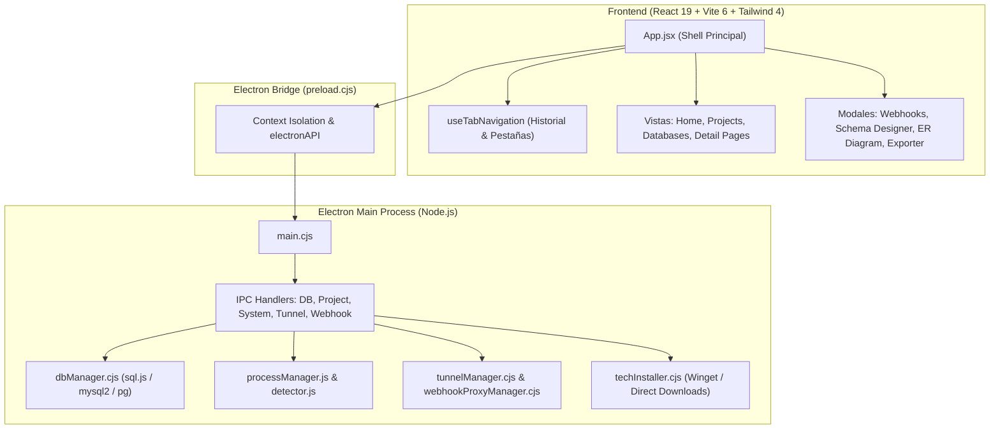
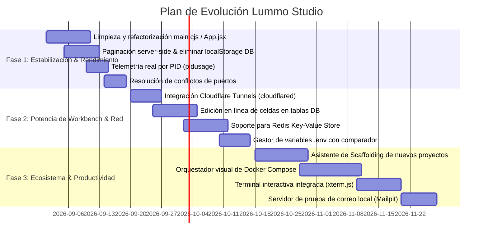

# 📋 Informe Técnico de Auditoría, Mejoras y Roadmap Estratégico
**Proyecto:** Lummo Studio (v2.2.0)  
**Tipo de Aplicación:** Desktop Developer Control Panel & Database Workbench (Alternativa moderna a XAMPP / Laragon / MAMP)  
**Stack Principal:** Electron 34.2 | React 19 | Vite 6.1 | Tailwind CSS 4.0 | Node.js | SQL Engines (SQLite, MySQL, PostgreSQL)  
**Fecha de Evaluación:** 26 de Agosto de 2026  

---

## 1. 🎯 Resumen Ejecutivo

**Lummo Studio** se posiciona como una alternativa de nueva generación a herramientas históricas pero desactualizadas como XAMPP, WAMP, MAMP y Laragon. Su enfoque combina la administración de servidores de desarrollo locales (Node.js, Vite, Next.js, PHP/Laravel, Python, Docker) con un potente **Database Workbench** relacional, utilidades de red avanzadas (Túneles públicos, Proxy de dominios locales `.test`, Inspector de Webhooks en vivo) y un gestor automatizado de tecnologías y dependencias.

El proyecto cuenta con una base sólida, pruebas unitarias automatizadas con **Vitest**, arquitectura IPC modular en Electron y un diseño UI/UX estilizado con soporte multilenguaje (Español e Inglés) y temas Claro/Oscuro.

Este informe presenta un análisis exhaustivo del estado actual del software, identifica puntos de fricción técnicos y deuda acumulada, y propone un **Roadmap de Mejoras de Alto Impacto** estructurado en fases para convertir a Lummo Studio en la herramienta de referencia para desarrolladores web.

---

## 2. 🏛️ Diagnóstico del Estado Actual de la Arquitectura

### Fortalezas Detectadas
1. **Sistema de Pestañas e Historial:** La navegación por pestañas con soporte para fijar (pin), duplicar, cerrar otras y botones de Atrás/Adelante proporciona una experiencia fluida tipo IDE.
2. **Database Workbench Integral:** Generador visual interactivo de diagramas Entidad-Relación (ER), exportación multiformato (CSV, JSON, TSV, SQL Dump), creador de esquemas y generador de datos Mock.
3. **Inspector de Webhooks en Tiempo Real:** El interceptor de tráfico con proxy reverso y capacidad de reenvío (Replay) de eventos (Stripe, Mercado Pago, GitHub, Shopify) es una característica diferencial que no poseen XAMPP ni Laragon.
4. **Instalador de Entorno Desatendido:** Descarga e instalación silenciosa de motores (Node.js LTS, Git, Python, PHP, Winget) con seguimiento de barra de progreso y velocidad en MB/s.

---

## 3. 🔍 Puntos Críticos y Deuda Técnica Detectada

| Área | Diagnóstico Actual | Riesgo / Impacto | Solución Recomendada |
| :--- | :--- | :--- | :--- |
| **Arquitectura de Estado** | `App.jsx` concentra más de 600 líneas con estados y lógica propia; existe un archivo `useLummoState.js` que quedó desacoplado. | Dificultad para mantener y testear el estado global; duplicación de controladores. | Refactorizar `App.jsx` para adoptar un store centralizado (Zustand o Context consolidado con `useLummoState`). |
| **Duplicación en Backend** | `electron/main.cjs` conserva implementaciones antiguas de detección y scripts que también existen en `electron/ipc/` y `electron/detector.js`. | Código duplicado, riesgo de divergencia de comportamiento en futuros cambios. | Limpiar `main.cjs` delegando 100% de la lógica a sus controladores IPC modulares. |
| **Motor SQLite (sql.js)** | `sql.js` (WebAssembly) carga la base de datos completa en un Buffer de memoria y reescribe el archivo completo a disco en cada mutación. | Ineficiente para bases de datos >20MB; alto consumo de RAM y bloqueo de UI. | Migrar a `better-sqlite3` en proceso Node secundario o SQLite worker nativo con transacciones reales y modo WAL. |
| **Persistencia de Tablas** | `DatabaseDetailPage.jsx` guarda registros de tablas en `localStorage` del frontend. | `localStorage` tiene límite de 5MB; con tablas medianas o motores remotos (MySQL/PG) puede saturar y romper la app. | Eliminar persistencia de filas remotas en `localStorage`; consultar siempre bajo demanda con paginación SQL (`LIMIT / OFFSET`). |
| **Métricas de Telemetría** | El consumo de CPU y RAM mostrado en los detalles del proyecto utiliza `Math.random()`. | Muestra datos ficticios en vez de telemetría real del proceso del sistema. | Integrar `pidusage` en el backend para obtener CPU (%), memoria RSS real y uptime exacto del PID. |
| **Túneles Públicos** | Dependencia única de `localtunnel` (suele fallar o requerir contraseña de IP). | Inestabilidad al exponer endpoints para webhooks remotos. | Agregar soporte multi-proveedor: **Cloudflare Tunnels (`cloudflared`)**, Ngrok y Pinggy. |
| **Certificados SSL** | Genera pares RSA autofirmados pero no los registra en el almacén de certificados raíz de Windows. | El navegador sigue mostrando advertencia de "Sitio Inseguro" al abrir `https://localhost`. | Integrar soporte para creación de CA local de confianza similar a `mkcert`. |

---

## 4. 🚀 Propuesta de Nuevas Funcionalidades y Mejoras

### Categoría A: Servidores y Gestión de Proyectos
1. **Resolución Inteligente de Conflictos de Puerto (Port Auto-Kill & Reassign):**
   - Cuando un puerto (ej. `3000` u `8080`) está ocupado por otra aplicación externa (como otro proceso Node huérfano), mostrar un diálogo claro: *"Puerto 3000 ocupado por PID 18420 (node.exe). ¿Deseas finalizar este proceso o usar el siguiente puerto libre (3001)?"*.
2. **Visor y Orquestador de Docker Compose Integrado:**
   - Detectar archivos `docker-compose.yml` en los proyectos y permitir iniciar/detener servicios individuales (Redis, Postgres, Mailpit, RabbitMQ) y ver sus logs desde Lummo Studio sin necesidad de abrir Docker Desktop.
3. **Asistente de Scaffolding de Nuevos Proyectos (New Project Wizard):**
   - Crear proyectos desde cero con un clic: Vite + React + Tailwind, Next.js 15 App Router, Express REST API, FastAPI o Laravel, ejecutando los generadores oficiales en una carpeta seleccionada.
4. **Gestor Avanzado de Variables de Entorno (`.env` Suite):**
   - Comparador interactivo entre `.env` y `.env.example` para alertar variables no configuradas.
   - Soporte para perfiles de entorno intercambiables (`.env.local`, `.env.staging`, `.env.production`).
   - Ocultamiento de claves secretas (tokens, passwords) con botón de revelar.
5. **Terminal Interactiva Embebida (xterm.js):**
   - Incorporar una pestaña de terminal interactiva real (PowerShell / Git Bash) dentro de la vista del proyecto para ejecutar comandos interactivos sin salir de Lummo Studio.

### Categoría B: Base de Datos y Workbench de Datos
1. **Visor de Tablas con Edición en Línea y Paginación Server-Side:**
   - Paginación dinámica (`Página 1 de 45`, selector de 25/50/100 filas por página).
   - Edición rápida de celdas haciendo doble clic con guardado automático mediante `UPDATE`.
   - Filtros dinámicos por columna (ej. `WHERE status = 'Active'`) y ordenamiento multi-columna.
2. **Soporte Nativo para Redis y Almacén Clave-Valor:**
   - Conexión a servidores Redis locales/remotos para inspeccionar Keys, TTLs, tipos (String, Hash, List, Set) y vaciar caché (`FLUSHDB`).
3. **Editor SQL con Autocompletado, Historial y Formateador:**
   - Historial de consultas ejecutadas recientemente.
   - Pestaña de "Consultas Favoritas" (Snippets guardados).
   - Formateador automático de SQL (Beautify SQL) y resaltado de sintaxis enriquecido.
4. **Soporte para SQLite Extensions y Spatial Data (SpatiaLite / GeoJSON Viewer):**
   - Capacidad de previsualizar datos geográficos o JSON embebidos directamente en el visor de datos.

### Categoría C: Red, APIs y Productividad
1. **Túneles Cloudflare (`cloudflared`) sin Configuración:**
   - Integración nativa de `cloudflared tunnel` para generar URLs públicas HTTPS (`*.trycloudflare.com`) ultra-rápidas y seguras sin caídas de conexión.
2. **Mejoras al Cliente de APIs (Postman/Insomnia Lite):**
   - Importación y exportación de colecciones formato Postman v2.1 y cURL.
   - Variables dinámicas en peticiones (ej. `{{baseUrl}}`, `{{token}}`).
   - Medidor de tiempo de respuesta desglosado (DNS, TTFB, Descarga).
3. **Sistema de Logs Avanzado:**
   - Búsqueda en tiempo real de logs con expresiones regulares (Regex).
   - Filtro por severidad: `[ALL]`, `[INFO]`, `[WARN]`, `[ERROR]`.
   - Botón de pausar autoscroll y exportar logs a archivo `.log` o `.txt`.
4. **Telemetría Real del Sistema:**
   - Medición de CPU (%), Memoria RAM (MB) y Uptime real del proceso utilizando `pidusage`.
5. **Servidor SMTP Local para Pruebas de Correo (Mailpit / Inbucket Mock):**
   - Captura de correos salientes generados por Laravel (`mail()`), Node.js (`nodemailer`) o Python en localhost, previsualizando el HTML de los emails enviados en una bandeja de entrada local.

---

## 5. 🗺️ Roadmap de Implementación Recomendado

---

## 6. 📊 Matriz de Priorización de Mejoras

| Mejora / Característica | Esfuerzo | Impacto | Prioridad |
| :--- | :---: | :---: | :---: |
| **Limpieza de código duplicado (`main.cjs` / `App.jsx`)** | Bajo | Alto | 🟢 Inmediata |
| **Paginación server-side y descarte de `localStorage` para filas DB** | Medio | Muy Alto | 🟢 Inmediata |
| **Telemetría real de procesos con `pidusage`** | Bajo | Medio | 🟢 Inmediata |
| **Integración de Cloudflare Tunnels (`cloudflared`)** | Medio | Muy Alto | 🟡 Alta |
| **Detección y liberación de procesos que bloquean puertos** | Bajo | Alto | 🟡 Alta |
| **Edición en línea de celdas en Workbench de BD** | Medio | Alto | 🟡 Alta |
| **Visor y cliente de Redis integrado** | Medio | Alto | 🟡 Alta |
| **Asistente de Scaffolding de proyectos (Vite/Next/Laravel/FastAPI)** | Medio | Alto | 🔵 Media |
| **Terminal interactiva embebida (xterm.js)** | Alto | Alto | 🔵 Media |
| **Gestor visual de contenedores Docker Compose** | Alto | Muy Alto | 🔵 Media |
| **Servidor de correo SMTP local para pruebas** | Medio | Medio | ⚪ Opcional |

---

## 7. 🏁 Conclusión

**Lummo Studio** posee una arquitectura moderna y una propuesta de valor excepcional frente a las suites de desarrollo tradicionales. Ejecutando la limpieza de deuda técnica de la **Fase 1** (optimizando la persistencia de datos y la sincronización IPC), e incorporando las herramientas de la **Fase 2** (Cloudflare Tunnels, Redis y edición de datos en vivo), el software alcanzará un nivel de madurez y competitividad de nivel profesional para cualquier desarrollador de software moderno.
